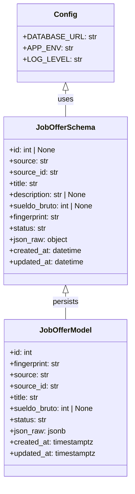
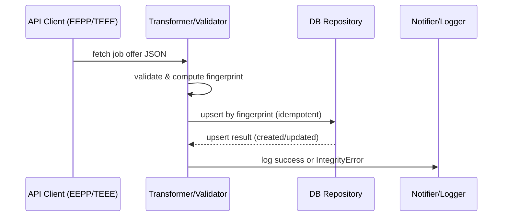

# Project Setup — Design

## Class Diagram

## Sequence Diagram

## Notes / Decisions
- `fingerprint`: MD5 hex string, unique constraint in DB.
- `sueldo_bruto`: stored as `Integer` (CLP) by default; can change to `Numeric` if decimals/precision required.
- `json_raw`: stored as JSONB for auditing.
- `status`: enum-like string (e.g., `active`, `finalizada`, `archived`) — soft delete semantics.

Persisted: `docs/design/project_setup.md`
